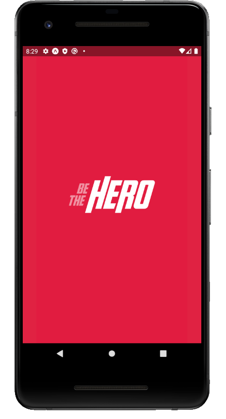

<h1 align="center">
  
    &nbsp;
  
</h1>

<h1 align="center"> semana-omnistack-11 </h1>

<h2 align="center">BE-THE-HERO</h2>


### 📃 Sobre 
  
Aplicação desenvolvida na **Semana OmniStack!!!**

---

### ⚒️ Tecnologias utilizadas

- [Node.js](https://nodejs.org/en/) 
- [Express.js](https://expressjs.com/pt-br/)
- [Knex.js](http://knexjs.org/)
- [Axios](https://www.npmjs.com/package/axios)
- [ReactJS](https://pt-br.reactjs.org/)
- [React Native](https://reactnative.dev/)
- [Celebrate](https://www.npmjs.com/package/celebrate)
- [Jest](https://jestjs.io/)
- [Expo](https://expo.io/)

---

### 🖥 Como baixar o projeto

```bash
  # Clonar o repositório:
  git clone git@github.com:heliton1988/semana-omnistack-11.git
  
```

Necessário ter o **yarn** instalado!

#### 🚀 Para rodar o server

```bash
  # Dentro da pasta "backend" rode:
  yarn

  # Na raiz da pasta backend rode:
  yarn dev
```

#### 🚀 Para subir o frontend web


```bash
  # Dentro da pasra "frontend" rode:
  yarn

  # Na raiz da pasta "frontend" rode: 
  yarn start
```

#### 🚀 Para rodar o mobile

```bash
  # Dentro da pasta "mobile" rode: 
  yarn

  # Na raiz da pasta "mobile" rode: 
  yarn
```

<p align="center">Com 💙 Héliton Oliveira</p>